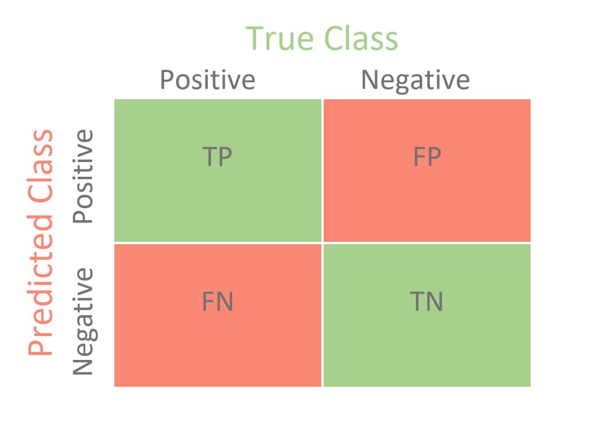
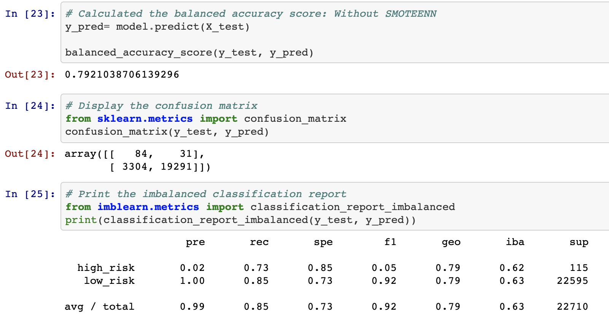
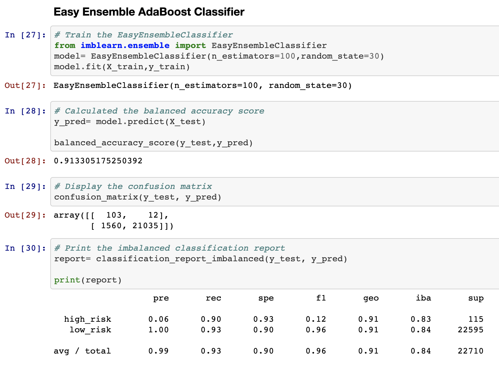
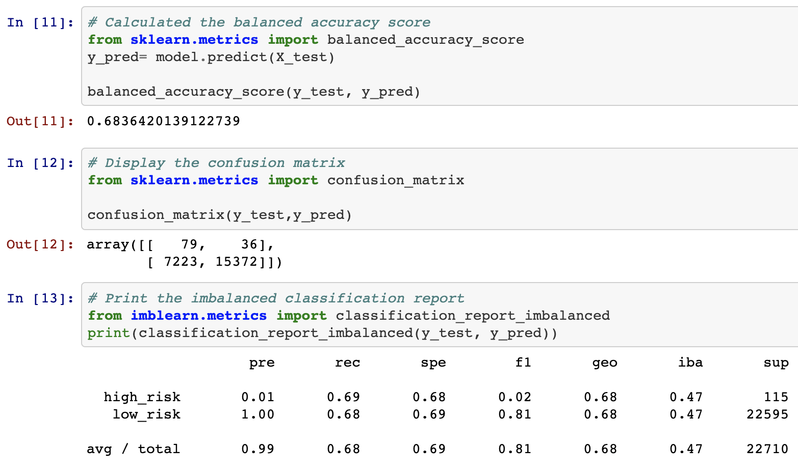
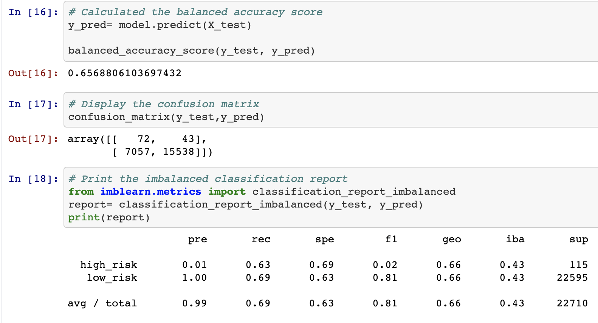
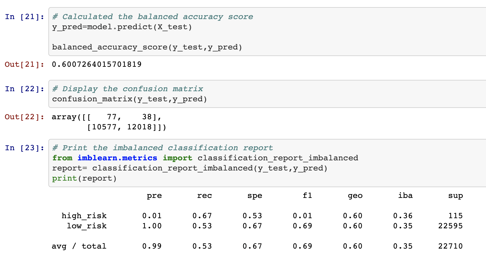
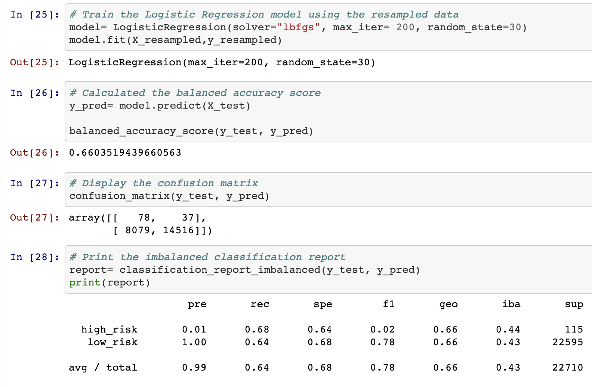

# Credit_Risk_Analysis

## Overview
Building and evaluating several machine learning models in the branch of Supervised Learning to predict credit risk. Being able to predict credit risk with machine learning algorithms can help banks and financial institutions predict anomalies, reduce risk cases, monitor portfolios, and provide recommendations on what to do in cases of fraud.

Credit risk is an inherently unbalanced classification problem, as good loans easily outnumber risky loans. When using data from LendingClub; a peer-to-peer lending services company to apply we to employ different techniques to train and evaluate models with unbalanced classes ...

### Understanding Machine Learning

Machine Learning → Supervised Learning → Classification OR Regression:

— Classification predicts the CATEGORY that data belongs to.

— Regression predicts a NUMERICAL value based on previously observed data.

### Resources

- Software: Visual Studio Code, Jupyter Lab
- Languages: Python
- Libraries: numpy, pandas, matplotlib, seaborn, scikit-learn
- Data Sources: Loan Data: LoanStats_2019Q1.csv.zip

## Results

- **BACKGROUND INFO:**

  - Precision Score= (Predicted True/ (Predicted True + False Positive)
  
  - People that were positive, we want to know the likelihood of actually being positive.
    
  - Recall Score= (Predicted True/ Predicted True + False Negative)
  
  - Person knows has a good loan status, but wants to know what the loan officer will give. 
    

**BalancedRandomForestClassifier**

    
  
- Accuracy_score (r_squared)= .79
- Precision= .99
- Recall= .85
 

**Ensemble AdaBoost Classifier**

- Accuracy_score (r_squared)= .91
- Precision= .99
- Recall= .93

**Naive Random Oversampling w/ Logistic Regression**

- Accuracy_score (r_squared)= .68
- Precision= .99
- Recall= .68

**SMOTE Oversampling w/ Logistic Regression**

- Accuracy_score (r_squared)= .66
- Precision= .99
- Recall= .69

**ClusterCentroids Undersampling w/ Logistic Regression**

- Accuracy_score (r_squared)= .60
- Precision= .99
- Recall= .53

**Combination (Over and Under) Sampling w/ Logistic Regression**

- Accuracy_score (r_squared)= .66
- Precision= .99
- Recall= .64

## Summary
To sum up, for our analysis the best overall model is the **Ensemble AdaBoost Classifier** that is generated to predict the unbalanced classification problem of credit risk, also the Balanced Random Forest Classifier is considered a great choice, both classifiers are considered best overall as they have high precision, recall, and accuracy scores which is close to 1 which is what we desire in our prediction problem. However, amoung the two the Ensemble AdaBoost Classifier is prefered as it has a higher overall scores for a classification prediction.
